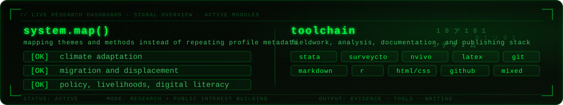

  

I work on climate adaptation, migration,water security, public policy, and sustainable livelihoods using mixed methods. Also interested in developing or contributing to public-interest tools, and digital literacy projects.

## Links

[Website](https://mdmohsinhossain.github.io/) · [Research](https://mdmohsinhossain.github.io/research/) · [Blog](https://mdmohsinhossain.github.io/blog/) · [CV](https://mdmohsinhossain.github.io/assets/cv/CV_Md_Mohsin_Hossain.pdf) · [LinkedIn](https://www.linkedin.com/in/md-mohsin-hossain)
